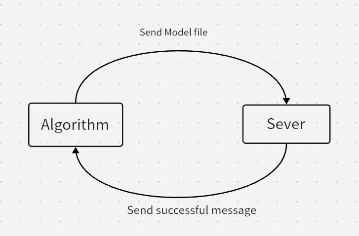
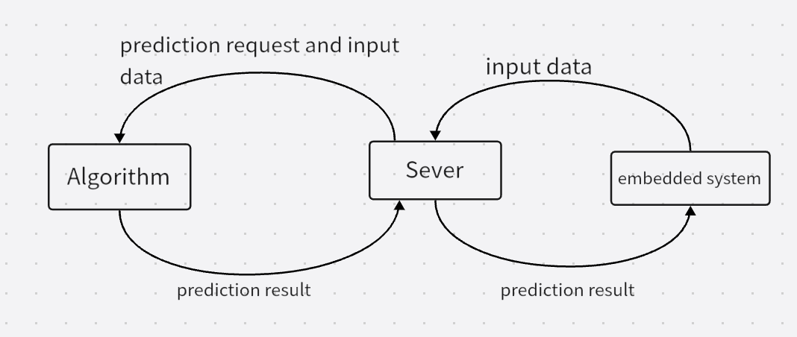
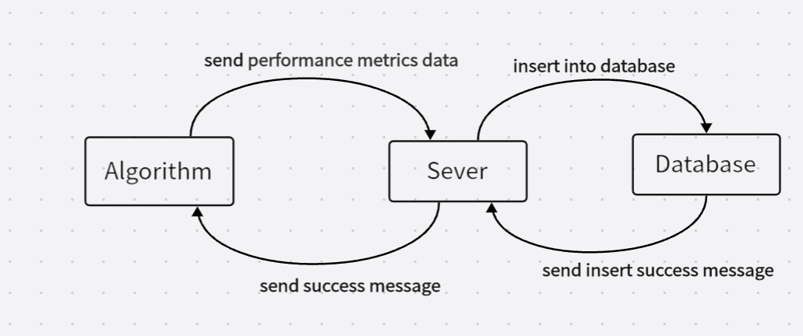

# Software Requirements Specification (Draft)

Revision History:

| Date | Author | Description |
| ---- | ------ | ----------- |
| March 17 | Fang Hanbin | Add use cases |

## Use Cases

Case: Get the training data
Case: train model
Case: Save the trained model
Case: personalized fine-tuned model checkpoints

Case: Algorithm Output prediction results

Case: Save the performance metrics of the Algorithm model

###Case : Get the training data

- version: 1
- Created: March 19
- Authors: Fang Hanbin
- Source: Algorithm
- Actors: Algorithm
- Goal: get training data
- Summary: Algorithm developers need to get the training data to train the model before the system starts working. We will use this data to train the model to get the model data
- Trigger: Input the number of expected training data samples and the name of dataset
- Frequency: Irregular or only once?
- Precondition: Have built the framework and designed the dataloader. Data formats are agreed upon.
- Postconditions: No

#### Basic Flow

| Actor                                                        | System                                                       |
| ------------------------------------------------------------ | ------------------------------------------------------------ |
| Send Algorithm-input request <Dataset name，the number of record in this  Dataset> |                                                              |
|                                                              | Receive the number and the dataset name                      |
|                                                              | Determine if dataset is exist and this demand number in specified dataset is reasonable. |
|                                                              | Fetch dataset from the database                              |
|                                                              | Return the specified dataset or warning                      |
| Algorithm-receive < expected training dataset>               |                                                              |

#### Alternative Flow

| Actor | System |
| ----- | ------ |
|       |        |
|       |        |
|       |        |
|       |        |
|       |        |

### Case: train model

- version: 1
- Created: March 19
- Authors: Fang Hanbin
- Source: Algorithm
- Actors: Algorithm
- Goal: get a trained model
- Summary: After get the train data,algorithm developer need to catch the possible data anomalies and clean the data and final train the model. Because training takes a lot of computing resources. Maybe we need to seed a signal to tell other part the server's GPU is busy.
- Trigger: the train data is sent to.
- Frequency: Irregular or only once?
- Precondition: get the train data.
- Postconditions: No

#### Basic Flow

| Actor                     | System                                             |
| ------------------------- | -------------------------------------------------- |
| Check the input data      |                                                    |
| Send train start message  |                                                    |
|                           | Receive the message and check if sever GPU is free |
|                           | wait until GPU is free,send permission.            |
| Train the model           |                                                    |
| send train finish message |                                                    |
|                           |                                                    |

#### Alternative Flow

| Actor                                                   | System                             |
| ------------------------------------------------------- | ---------------------------------- |
| Find the input data error,repeat request the input data |                                    |
|                                                         | repeat to send data to train model |
|                                                         |                                    |
|                                                         |                                    |
|                                                         |                                    |

### Case: Save the trained model

- Version: 1
- Created:  March 19
- Authors: Fang Hanbin
- Source: Server
- Actors: Algorithm
- Goal: Save the trained model
- Summary: When algorithm developers have trained the model successfully, they will save the model in sever.
- Trigger: Input the pretrained model checkpoints
- Frequency: Irregular or only once?
- Precondition: Algorithm developers have trained the model successfully
- Postconditions: No

#### Basic Flow

| Actor                               | System                    |
| ----------------------------------- | ------------------------- |
| Algorithm send train finish message |                           |
|                                     | Recevie the model file    |
|                                     | Save the model in sever。 |
|                                     | Return success            |
| Algorithm receive success message   |                           |
|                                     |                           |

#### Alternative Flow

| Actor | System |
| ----- | ------ |
|       |        |
|       |        |
|       |        |
|       |        |

### Case: personalized fine-tuned model checkpoints

- Version: 1
- Created: March 19
- Authors: Fang Hanbin
- Source: Server
- Actors: Algorithm
- Goal: personalized fine-tuned model checkpoints
- Summary: Based on pretrained model  and personalized  features,  fine tune the model and save the personalized model checkpoint into the database
- Trigger: Input name
- Frequency: 1 day
- Precondition:  Postconditions: No

#### Basic Flow

| Actor                                                       | System                                        |
| ----------------------------------------------------------- | --------------------------------------------- |
| Algorithm input person name                                 |                                               |
|                                                             | Algorithm input person name                   |
|                                                             | Check that if name exists                     |
|                                                             | Return model checkpoint and personalized data |
| Algorithm receive the model parametrs and personalized data |                                               |
| Algorithm input fine-tuned personalized model checkpoint    |                                               |
|                                                             | Receive the personalized model checkpoints    |
|                                                             | Save  the checkpoint into the database        |
|                                                             | Return success                                |
| Algorithm receive the personalized-model-successfully-save  |                                               |

#### Alternative Flow

| Actor | System |
| ----- | ------ |
|       |        |
|       |        |
|       |        |
|       |        |
|       |        |
|       |        |

// We need to deploy the model to an embedded device，maybe？

### Case: Algorithm Output prediction results

- Version: 1

- Created: March 20

- Authors: Fang Hanbin

- Source: Server

- Actors: Algorithm

- Goal: Algorithm Output prediction results

- Summary: After the input crossing the model,  Algorithm will output the prediction results

- Trigger: Algorithm output the results

- Frequency: To be determined 

- Precondition: When Algorithm received the prediction request. 

- Postconditions: When Algorithm has finished making predictions 

  

#### Basic Flow

| Actor                                              | System                                           |
| -------------------------------------------------- | ------------------------------------------------ |
| Algorithm input prediction results                 | Sever send the prediction request and input data |
| receive the input data and sent it cross the model |                                                  |
| Algorithm send prediction result                   |                                                  |
|                                                    | Receive the prediction result                    |
|                                                    | Return prediction to the  embedded system        |
|                                                    |                                                  |

#### Alternative Flow

| Actor | System |
| ----- | ------ |
|       |        |

### Case: Save the performance metrics of the Algorithm model

- Version: 1

- Created: Mar. 20

- Authors: Fang Hanbin

- Source: Server

- Actors: Algorithm

- Goal: The algorithm wants to store the performance metrics of the Algorithm model in database

- Summary: 

- Trigger: 

- Frequency: Irregular 

- Precondition: Algorithm has trained their model and run the sensor data in their model

- Postconditions: The database has stored the performance metrics of the Algorithm model

  

#### Basic Flow

| Actor                                   | System                                  |
| --------------------------------------- | --------------------------------------- |
| Algorithm send performance metrics data |                                         |
|                                         | Sever received it                       |
|                                         | Sever send it to database               |
|                                         | Database stores it                      |
|                                         | Database send success message           |
|                                         | Sever send success message to Algorithm |

#### Alternative Flow

| Actor | System |
| ----- | ------ |
|       |        |
|       |        |
|       |        |
|       |        |
|       |        |
|       |        |
|       |        |

