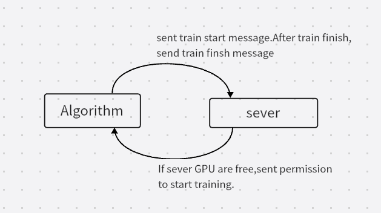

# Software Requirements Specification 

Revision History:

| Date | Author | Description |
| ---- | ------ | ----------- |
| March 17 | Fang Hanbin | Add use cases |
| May 7 | Fang Hanbin | Add use cases |

## Use Cases

Case: Get the training data

Case: train model

Case: Save the trained model

Case: personalized fine-tuned model checkpoints

Case: Algorithm prediction.

Case: personalized  model clean.

Case: Predict train time

Case: Return user model state 

######Request: sever supports multiple threads the environment has a graphics card

###Case : Get the training data

- version: 1
- Created: March 19
- Authors: Fang Hanbin
- Source: Algorithm
- Actors: Algorithm
- Goal: get training data
- Summary: Algorithm developers need to get the training data to train the model before the system starts working. We will use this data to train the model to get the model data（Before the project is deployed）
- Trigger: Input the number of expected training data samples and the name of dataset
- Frequency: Irregular or only once?
- Precondition: Have built the framework and designed the dataloader. Data formats are agreed upon.
- Postconditions: No

#### Basic Flow

| Actor                                                        | System                                                       |
| ------------------------------------------------------------ | ------------------------------------------------------------ |
| Send Algorithm-input request <Dataset name，the number of record in this  Dataset> |                                                              |
|                                                              | Receive the number and the dataset name                      |
|                                                              | Determine if dataset is exist and this demand number in specified dataset is reasonable. |
|                                                              | Fetch dataset from the database                              |
|                                                              | Return the specified dataset or warning                      |
| Algorithm-receive < expected training dataset>               |                                                              |

#### Alternative Flow

| Actor | System |
| ----- | ------ |
|       |        |
|       |        |
|       |        |
|       |        |
|       |        |

### Case: train model

- version: 1
- Created: March 19
- Authors: Fang Hanbin
- Source: Algorithm
- Actors: Algorithm
- Goal: get a trained model
- Summary: After get the train data,algorithm developer need to catch the possible data anomalies and clean the data and final train the model. Because training takes a lot of computing resources. Maybe we need to seed a signal to tell other part the server's GPU is busy.（Before the project is deployed）
- Trigger: the train data is sent to.
- Frequency: Irregular or only once?
- Precondition: get the train data.
- Postconditions: No

#### Basic Flow

| Actor                     | System                                             |
| ------------------------- | -------------------------------------------------- |
| Check the input data      |                                                    |
| Send train start message  |                                                    |
|                           | Receive the message and check if sever GPU is free |
|                           | wait until GPU is free,send permission.            |
| Train the model           |                                                    |
| send train finish message |                                                    |
|                           |                                                    |

#### Alternative Flow

| Actor                                                   | System                             |
| ------------------------------------------------------- | ---------------------------------- |
| Find the input data error,repeat request the input data |                                    |
|                                                         | repeat to send data to train model |
|                                                         |                                    |
|                                                         |                                    |
|                                                         |                                    |

### Case: Save the trained model

- Version: 1
- Created:  March 19
- Authors: Fang Hanbin
- Source: Server
- Actors: Algorithm
- Goal: Save the trained model
- Summary: When algorithm developers have trained the model successfully,store it.
- Trigger: Input the pretrained model checkpoints
- Frequency: regular.
- Precondition: Algorithm developers have trained the model successfully
- Postconditions: No

#### Basic Flow

| Actor                               | System                     |
| ----------------------------------- | -------------------------- |
| Algorithm send train finish message |                            |
|                                     | Recevie the model file     |
|                                     | Save the model in system。 |
|                                     |                            |
|                                     |                            |
|                                     |                            |

#### Alternative Flow

| Actor | System |
| ----- | ------ |
|       |        |
|       |        |
|       |        |
|       |        |

### Case: personalized fine-tuned model checkpoints

- Version: 1
- Created: March 19
- Authors: Fang Hanbin
- Source: Server
- Actors: Algorithm
- Goal: personalized fine-tuned model checkpoints
- Summary: Based on pretrained model  and personalized  features,  fine tune the model and save the personalized model checkpoint into the database
- Trigger: Input name
- Frequency: 1 day
- Precondition:  Postconditions: No

#### Basic Flow

| Actor                                                        | System                                        |
| ------------------------------------------------------------ | --------------------------------------------- |
| Algorithm input person name                                  |                                               |
|                                                              | Algorithm input person name                   |
|                                                              | Check that if name exists                     |
|                                                              | Return model checkpoint and personalized data |
| Algorithm receive the model parameters and personalized data |                                               |
| Algorithm input fine-tuned personalized model checkpoint     |                                               |
|                                                              | Receive the personalized model checkpoints    |
|                                                              | Save  the checkpoint into the database        |
|                                                              | Return success                                |
| Algorithm receive the personalized-model-successfully-save   |                                               |

#### Alternative Flow

| Actor | System |
| ----- | ------ |
|       |        |
|       |        |
|       |        |
|       |        |
|       |        |
|       |        |

// We need to deploy the model to an embedded device，maybe？ no.

### Case: Algorithm prediction 

- Version: 1
- Created: March 20
- Authors: Fang Hanbin
- Source: Server
- Actors: Algorithm
- Goal: Algorithm Output prediction results
- Summary: After the input crossing the model,  Algorithm will output the prediction results
- Trigger: Algorithm output the results
- Frequency: To be determined 
- Precondition: When Algorithm received the prediction request. 
- Postconditions: When Algorithm has finished making predictions 

####  Basic Flow

| Actor                              | System                                           |
| ---------------------------------- | ------------------------------------------------ |
|                                    | Sever send the prediction request and input data |
| Algorithm input prediction results |                                                  |
| Algorithm return output            |                                                  |
|                                    | Receive the prediction result                    |
|                                    |                                                  |
|                                    |                                                  |

#### Alternative Flow

| Actor | System |
| ----- | ------ |
|       |        |

### Case: personalized  model clean.

- Version: 1
- Created: March 20
- Authors: Fang Hanbin
- Source: Server
- Actors: Algorithm
- Goal: Remove the specialization model
- Summary: personalized  model clean. 
- Trigger: --
- Frequency: To be determined 

####  Basic Flow

| Actor       | System                 |
| ----------- | ---------------------- |
|             | Sever send the request |
| model clear |                        |
|             |                        |
|             |                        |
|             |                        |
|             |                        |

#### Alternative Flow

| Actor | System |
| ----- | ------ |
|       |        |

### Case: Predict train time

- Version: 1
- Created: May 7
- Authors: Fang Hanbin
- Source: Server
- Actors: Algorithm 
- Goal:  Predict train time
- Summary:  Predict train time
- Trigger: --
- Frequency: To be determined 

####  Basic Flow

| Actor               | System                     |
| ------------------- | -------------------------- |
|                     | request predict train time |
| return predict time |                            |
|                     |                            |
|                     |                            |
|                     |                            |
|                     |                            |

#### Alternative Flow

| Actor | System |
| ----- | ------ |
|       |        |

### Case:Return user model state

- Version: 1
- Created: May 7
- Authors: Fang Hanbin
- Source: Server
- Actors: Algorithm 
- Goal:  Return user model state
- Summary:  Predict user model state is generalization or specialization model
- Trigger: --
- Frequency: To be determined 

####  Basic Flow

| Actor                   | System                   |
| ----------------------- | ------------------------ |
|                         | request user model state |
| return user model state |                          |
|                         |                          |
|                         |                          |
|                         |                          |
|                         |                          |

#### Alternative Flow

| Actor | System |
| ----- | ------ |
|       |        |